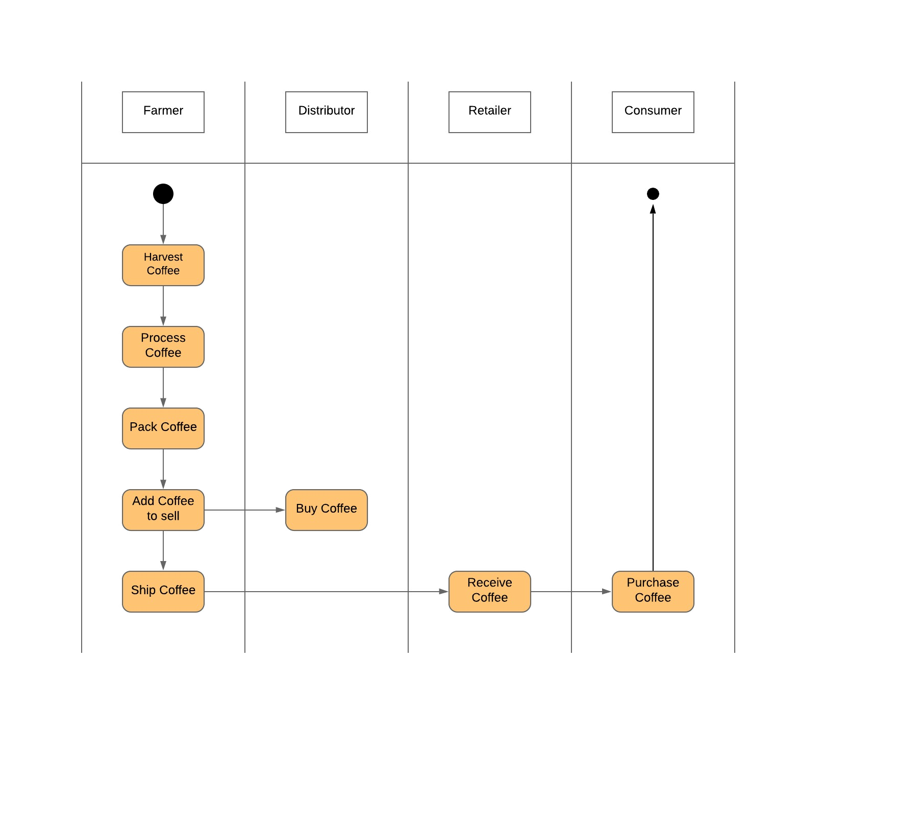
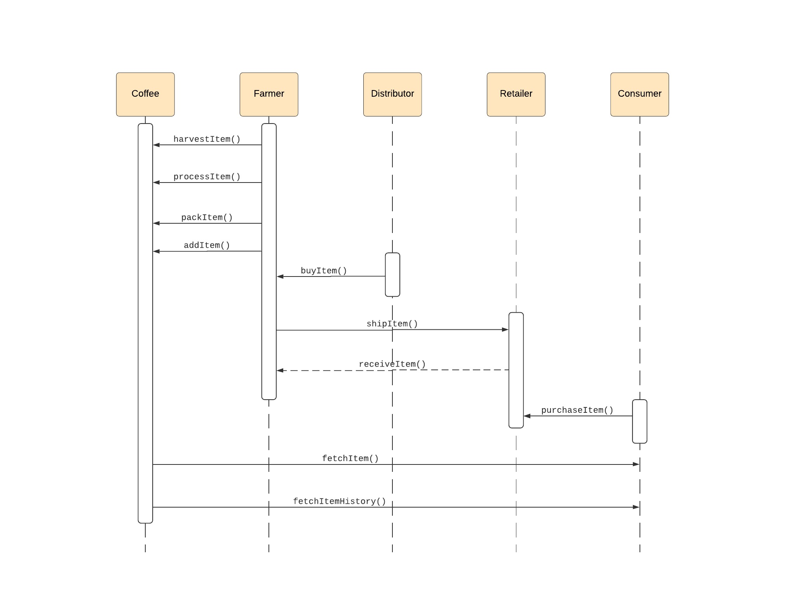
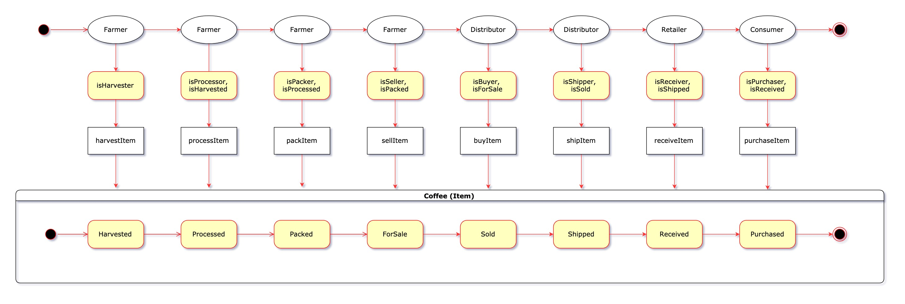
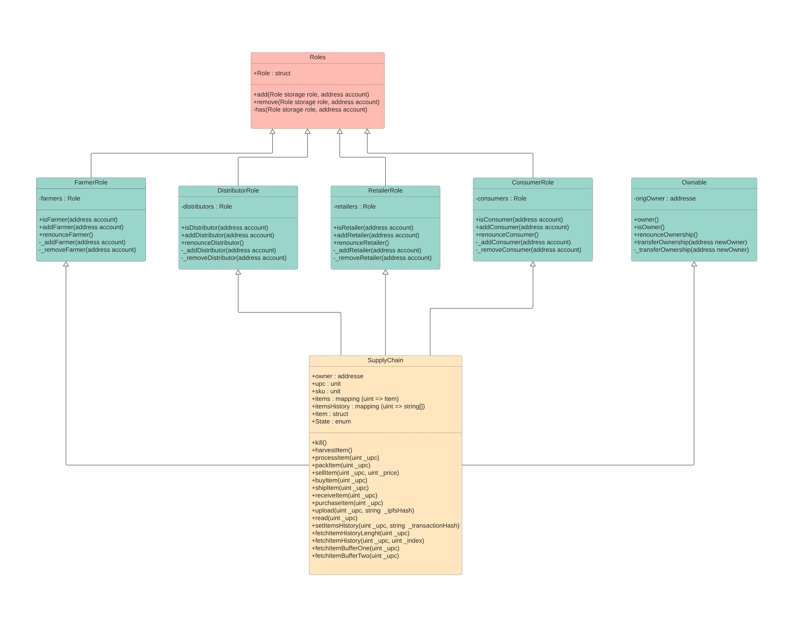
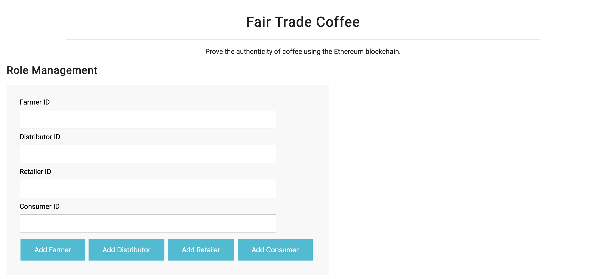
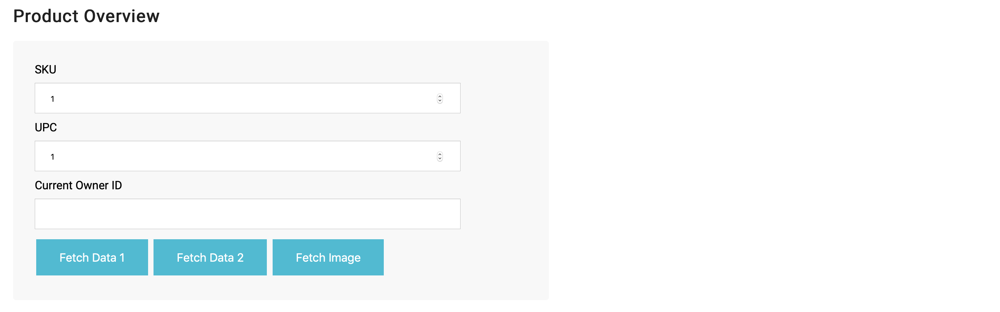
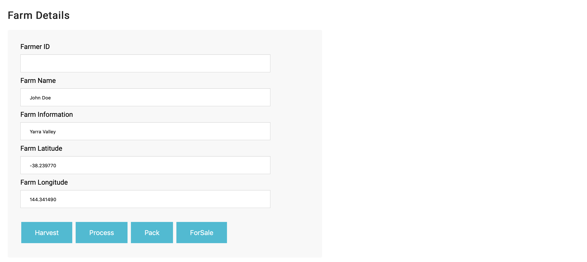
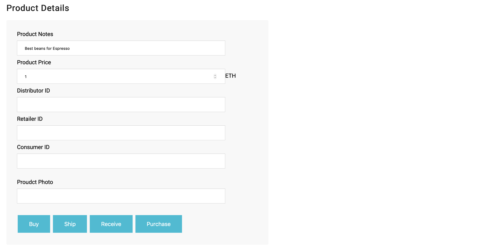
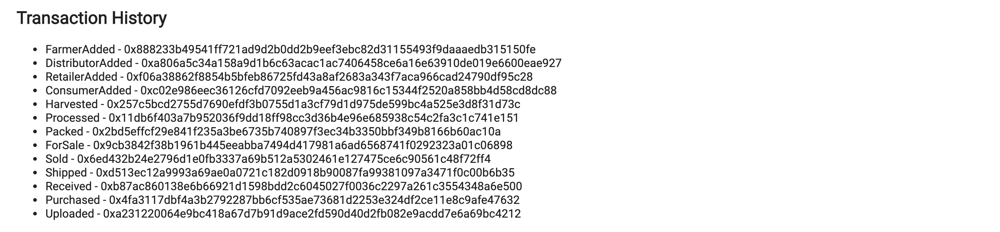

# Coffee Supply Chain

## Description
Ethereum DApp that demonstrates a Supply Chain flow between a Seller and Buyer. The user story is similar to any commonly used supply chain process. A Seller can add items to the inventory system stored in the blockchain. A Buyer can purchase such items from the inventory system. Additionally a Seller can mark an item as Shipped, and similarly a Buyer can mark an item as Received.

### Actors
* Farmer
* Distributor
* Retailer
* Consumer

### Actions
* **Farmer** – A Farmer can harvest coffee, process coffee, pack coffee, add coffee to sell, ship coffee
* **Distributor** – A Distributor can buy coffee
* **Retailer** – A Retailer can receive coffee
* **Consumer** – A Consumer can purchase coffee

Different steps that a product (coffee)  goes through until it will be bought by a consumer like showed in the UML Activity Digram below.

## UML Diagrams

### Activity Diagram


### Sequence Diagram


### State Diagram


### Data Model Diagram


## User Interface

### Role Management Section
User can can add a new farmer, distributor, retailer or a consumer to the list of users of the DApp.



### Product Overview Section
User can fetch information about concrete product.
* **Fetch Data 1** – Fetch farmer related data
* **Fetch Data 2** – Fetch the product data related the distributor, the retailer and the consumer.
* **Fetch Image** – Fetch the product image stored in the INFURA IPFS node.



### Farmer Details Section
This form is used to show the Farmer ID, Name, coordinates (Long and Lat) fetched by the **Fetch Data 1** button.
It is used also to input the farmer's information.
In this section a Farmer can harvest coffee → process coffee → pack coffee bags → prepare them for sale.
* **Harvest** – This button calls the harvestItem() method of the SupplyChain.sol contract.
* **Process** – This button calls the processItem() method of the SupplyChain.sol contract.
* **Pack** – This button calls the packItem() method of the SupplyChain.sol contract.
* **Buy** – This button calls the buyItem() method of the SupplyChain.sol contract.



### Product Details Section
This form is used to show the information fetched by the **Fetch Data 2** button.
It is used also to input the product's information.
In this section a distributor can buy Coffee and a farmer can ship Coffee to Retailer.
Retailer can receive coffee. And finally Consumer can purchase Coffee from Retailer.
* **Buy** – This button calls the buyItem() method of the SupplyChain.sol contract.
* **Ship** – This button calls the shipItem() method of the SupplyChain.sol contract.
* **Receive** – This button calls the receiveItem() method of the SupplyChain.sol contract.
* **Purchase** – This button calls the purchaseItem() method of the SupplyChain.sol contract.



### IPFS Image Uploader
This section allows a product owner to upload an image of the product.


### Transaction History Section
This section contains transaction hashs of all transactions that was produced by processing a product in the supply chain.



## Libraries

* Truffle v5.0.25 (core: 5.0.25)
* Solidity v0.5.0 (solc-js)
* Node v10.15.3
* Web3.js v1.0.0-beta.37
* ipfs version 0.4.21

## IPFS

IPFS is used to store the product image outside the Ethereum blockchain. Instead of that, the ipfs hash of the image is stored in the Ethereum blockchain.

### Install

This module uses node.js, and can be installed through npm:

```bash
npm install --save ipfs-http-client
```

### Importing the module and usage
**from CDN**

Instead of a local installation, I request a remote copy of IPFS API from [unpkg CDN](https://unpkg.com/).

```html
<!-- loading the minified version -->
<script src="https://unpkg.com/ipfs-http-client/dist/index.min.js"></script>
<!-- loading the human-readable (not minified) version -->
<script src="https://unpkg.com/ipfs-http-client/dist/index.js"></script>
```

CDN-based IPFS API provides the `IpfsHttpClient` constructor as a method of the global `window` object.

```js
initIPFS: async function(){

  ipfs = new window.IpfsHttpClient('ipfs.infura.io', '5001', { protocol: 'https' });
},
```

### CORS

In a web browser IPFS HTTP client (either browserified or CDN-based) might encounter an error saying that the origin is not allowed. This would be a CORS ("Cross Origin Resource Sharing") failure: IPFS servers are designed to reject requests from unknown domains by default. You can whitelist the domain that you are calling from by changing your ipfs config like this:

```console
$ ipfs config --json API.HTTPHeaders.Access-Control-Allow-Origin  '["http://example.com"]'
$ ipfs config --json API.HTTPHeaders.Access-Control-Allow-Methods '["PUT", "POST", "GET"]'
```

### Add files and data to IPFS
To add a file to the Infura IPFS node, the ipfs.add() method is used.

- [`ipfs.add(data, [options], [callback])`](https://github.com/ipfs/interface-ipfs-core/blob/master/SPEC/FILES.md#add)

```js
addImage:async function(file) {

  ipfs.add(file).then(function(result) {
    App.ipfsHash = result[0].hash;
      console.log("IPFS Hash:" + result[0].hash);
      return App.upload();
  }).catch(function(err) {
      console.log(err.message);
  });

},
```

## How To Start
1. Clone this repository
```
git clone https://github.com/Abderrazzak87/Coffee-Supply-Chain-DApp.git
```
2. Change directory to ```app``` folder and install all requisite npm packages:
```
cd app
npm init
npm install
npm install --save ipfs-http-client
```
3. Launch ganache:
```
ganache-cli -m "design junk dune any pitch cabin ability ancient dirt uncover gym resource"
```
4. In a separate terminal window, Compile smart contracts:
```
truffle compile
```
5. Migrate smart contracts to the locally running blockchain, ganache-cli:
```
truffle migrate
```
6. Test smart contracts:
```
truffle test
```
7. In a separate terminal window, launch the DApp:
```
npm run dev
```

## Deployed contract (Rinkeby)
* Transaction ID – 0x110b21004d787b90ee7527a983376890fa9ea69658a5a3c42e159b712493d53e
* Contract ID – 0xBbAc1A496802eb3ec4f688002f462C2483515C65

* https://rinkeby.etherscan.io/address/0xBbAc1A496802eb3ec4f688002f462C2483515C65

### Transaction History
* FarmerAdded - 0x888233b49541ff721ad9d2b0dd2b9eef3ebc82d31155493f9daaaedb315150fe
* DistributorAdded - 0xa806a5c34a158a9d1b6c63acac1ac7406458ce6a16e63910de019e6600eae927
* RetailerAdded - 0xf06a38862f8854b5bfeb86725fd43a8af2683a343f7aca966cad24790df95c28
* ConsumerAdded - 0xc02e986eec36126cfd7092eeb9a456ac9816c15344f2520a858bb4d58cd8dc88
* Harvested - 0x257c5bcd2755d7690efdf3b0755d1a3cf79d1d975de599bc4a525e3d8f31d73c
* Processed - 0x11db6f403a7b952036f9dd18ff98cc3d36b4e96e685938c54c2fa3c1c741e151
* Packed - 0x2bd5effcf29e841f235a3be6735b740897f3ec34b3350bbf349b8166b60ac10a
* ForSale - 0x9cb3842f38b1961b445eeabba7494d417981a6ad6568741f0292323a01c06898
* Sold - 0x6ed432b24e2796d1e0fb3337a69b512a5302461e127475ce6c90561c48f72ff4
* Shipped - 0xd513ec12a9993a69ae0a0721c182d0918b90087fa99381097a3471f0c00b6b35
* Received - 0xb87ac860138e6b66921d1598bdd2c6045027f0036c2297a261c3554348a6e500
* Purchased - 0x4fa3117dbf4a3b2792287bb6cf535ae73681d2253e324df2ce11e8c9afe47632
* Uploaded - 0xa231220064e9bc418a67d7b91d9ace2fd590d40d2fb082e9acdd7e6a69bc4212
